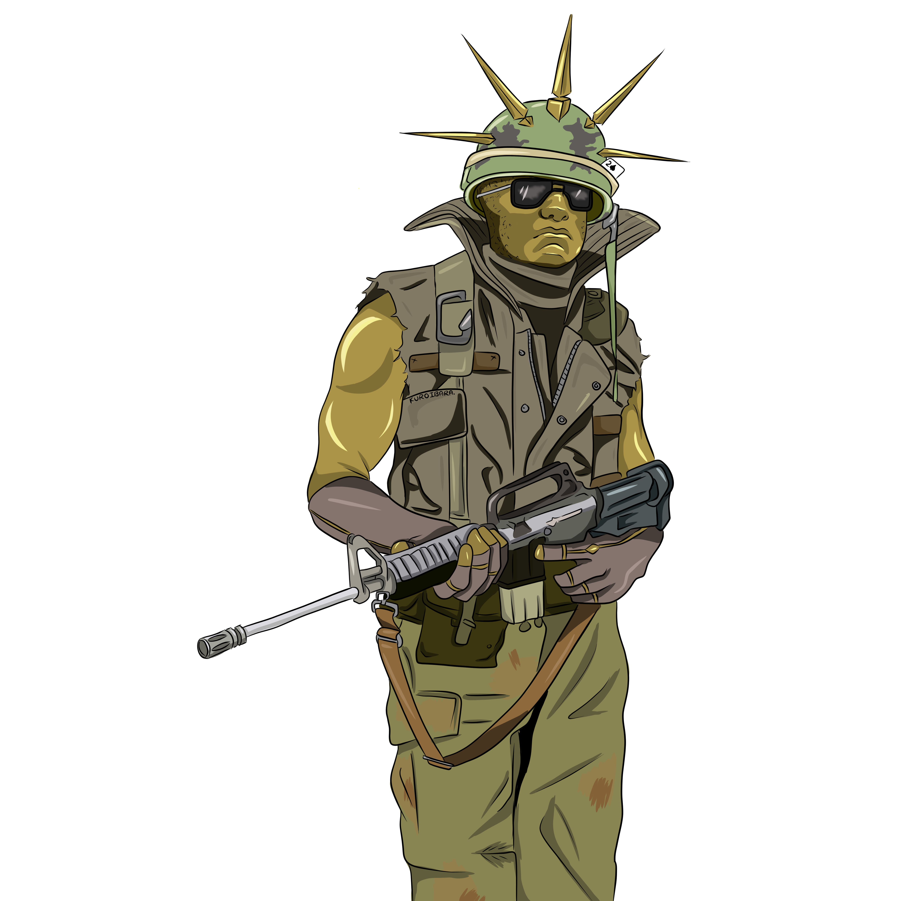

<h1 align="center">TTW3 Toolkit</h1>

**Навигация**

- [Гайд на модификацию](#гайд-на-модификацию)
- [Скачать модификацию](https://github.com/sashapop10/ttw3/archive/refs/heads/main.zip)
- [Гайд на мультиплеер](#гайд-на-мультиплеер)
- [Старая коллекция модов](https://steamcommunity.com/sharedfiles/filedetails/?id=2947823975)

**История обновлений**

- `05.02.25` > Перевод & мультиплеер
- `02.02.25` > Omens of Destruction
- `10.08.24` > Thrones of Decay
- `14.08.23` > Shadows of Change
- `13.04.23` > Forge of the Chaos Dwarfs

## Гайд на модификацию

### Установка модификации

1. Качаем архив [здесь](https://github.com/shuritch/ttw3/archive/refs/heads/main.zip)
2. Переносим все из папки `modification` в **КОРЕНЬ** папки игры (steam > ttw3 > properties > Установленные файлы > Обзор)

### Обновления модификации

Если вышло новое DLC и оно не доступно, надо обновить самому следуя инструкции ниже:

1. Открываем `cream_api.ini` в блокноте.
2. Находим секцию DLC.
3. Находим DLC здесь [here](https://steamdb.info/search/?a=all&q=total+war%3A+warhammer+3)
4. Берем DLC_ID из ссылки **по примеру**: https://steamdb.info/app/ `2891710`
5. Берем DLC_NAME из названия DLC, строгая копия
6. Вставляем по формату `DLC_ID = DLC_NAME`
7. Сохраняем и радуемся.

## Гайд на мультиплеер

### I. Переустановка

1. `Win+r` вводим _%AppData%_
2. Удаляем папку Creative assembly
3. Удаляем игру и ставим заново (На самый быстрый диск)
4. Меняем язык на английский
5. Ставим наш чит (чтобы исключить краш из-за него)

### II. Ставим QoL

1. [Фиксы от сообщества](https://steamcommunity.com/sharedfiles/filedetails/?id=2856936614&searchtext=+community+bug+fux+mod+)

### III. Сетевая топология

1. Качаем [Инструмент](https://www.radmin-vpn.com/ru/)
2. `Win+r` Пишем `Shell:ControlPanelFolder`
3. Брандмауэр Защитника Windows **>** Доп. параметры (слева)
4. Действие (сверху на панеле) **>** свойства
5. Или отключаем брэндмауэр и идем на **7** пункт или идем на **6**
6. Нажимаем настроить (первая - отключаем VPN), делаем тоже в общем и частном профиле (сверху)
7. `Win+r` Пишем `Shell:ControlPanelFolder`
8. Центр управления сетями и общим доступом **>** Изменение параметров адаптера
9. Кight click hamachi > properties > select Internet Protocol Version 4 > properties > advanced.
10. Make sure Automatic Metric box is deselected and type 1 into the interface metric, click ok.

### IV. В игре

1. Закрыть сетевые приложения (торрент, телеграм и тд), трафик грузит общую сеть
2. Подключиться к самому хорошему интернету
3. Не использовать дипломатию в готовности
4. Отключить быстрые ходы (Если проблема в компьютере)
5. Снижаем настройки игры, чтобы грузиться быстрее (если есть разница)
6. Если вылетает, оказывается, можно присоединится на след. ходу ИЛИ **=>>**
7. ? Если вылетает, делаем проверку файлов, сохраняем игру, грузим новый сейв

### VI. Причины де-синхронизации

1. Разная скорость реакции компьютеров игроков (ссд, сеть) [ПРУФ](https://www.reddit.com/r/totalwarhammer/comments/1bwxhvl/wh3_multiplayer_local_lan_with_hamachi/)
2. Моды модернизирующие папку с игрой [ПРУФ](https://www.reddit.com/r/totalwarhammer/comments/1bwxhvl/wh3_multiplayer_local_lan_with_hamachi/)
3. Еще пишут что-то про 2 эффекта персонажа (яд и огонь) [ПРУФ](https://community.creative-assembly.com/total-war/total-war-warhammer/bugs/bugs-redirect/6520-warhammer-3-contact-effects-dysenc-in-multiplayer)
4. Краш из-за разницы локализации [ПРУФ](https://community.creative-assembly.com/total-war/total-war-warhammer/bugs/5697-multiplayer-crash-when-players-have-different-game-localisation-languages?page=1)
5. Дипломатия в готовности [ПРУФ](https://community.creative-assembly.com/total-war/total-war-warhammer/bugs/2801-multiplayer-campaign-desync-on-5-1?page=1)

### VII. Еще больше объяснений

1. Вылетало каждые 5 ходов из-за локализации
2. Вылетало при нападении на мой город из-за эффектов лорда
3. Десинк всегда из-за проблемы с интерном (у кого-то что-то не успело)
